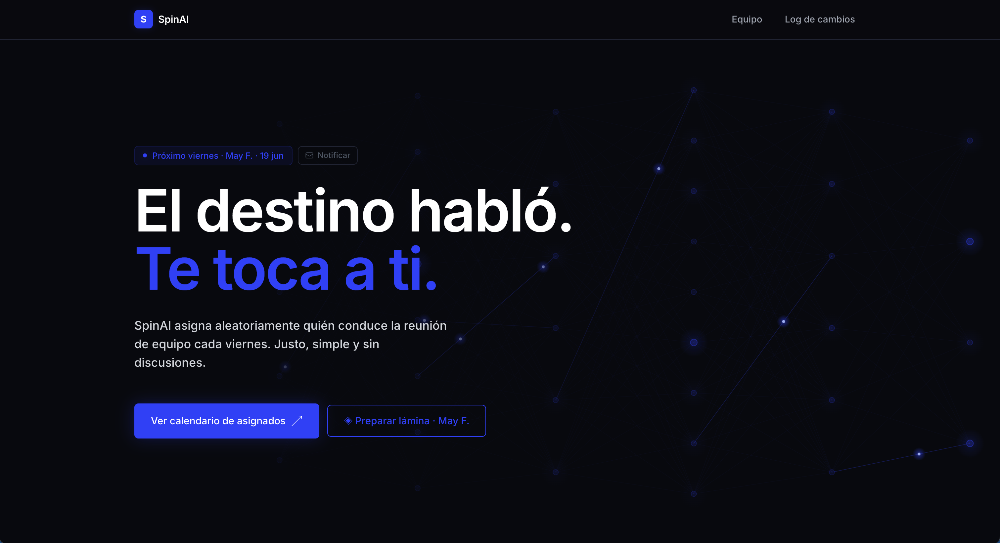

# SpinAI

> Asigna aleatoriamente quién conduce la reunión de equipo cada viernes. Justo, simple y sin discusiones.



---

## ¿Qué es SpinAI?

SpinAI es una app interna para equipos que necesitan rotar el rol de facilitador en reuniones semanales. La ruleta decide, el calendario organiza, y el email notifica — todo en un solo lugar.

---

## Funcionalidades

- **Ruleta de asignación** — gira y asigna aleatoriamente a cada integrante activo un viernes
- **Calendario de asignados** — visualiza los próximos turnos con drag & drop para intercambiar fechas
- **Preparación de láminas** — cada asignado puede preparar su agenda, puntos clave y notas antes de la reunión
- **Vista de presentación** — modo pantalla completa con ítems tachables durante la reunión
- **Notificación manual** — botón en el home para avisar al equipo quién presenta este viernes
- **Notificación automática** — GitHub Actions envía el email cada lunes a las 9:00 AM automáticamente
- **Log de cambios** — historial de todos los intercambios de turno realizados
- **Acceso protegido** — PIN gate con JWT y cookie HttpOnly
- **Microinteracciones de entrada** — animaciones sutiles de fade + desplazamiento (220–320ms, con stagger por fila/sección) al abrir el log de cambios, el calendario, la vista "preparar lámina" y la vista de equipo; respetan `prefers-reduced-motion` desde el primer paint
- **Noticias de IA** (`/noticias`) — feed curado de actualidad de IA, agregado desde 10 fuentes (OpenAI, Google DeepMind, Hugging Face, MIT Technology Review, The Verge, Ars Technica, TechCrunch, VentureBeat, Wired, Import AI), con filtro por fuente, paginación y aviso de "suscripción requerida" cuando aplica. Se refresca automáticamente cada 3 horas vía GitHub Actions
- **State of AI** (`/state-of-ai`) — panel del estado del ecosistema de modelos de IA: resumen ejecutivo generado automáticamente, timeline de lanzamientos recientes, ranking de modelos por índice de inteligencia (Artificial Analysis) con comparador de hasta 4 modelos, relación inteligencia-vs-precio, ranking de laboratorios, trending de Hugging Face (modelos y papers), papers recientes de arXiv (cs.AI), y un mapa curado del panorama de IA y de agentes. Los datos (modelos, papers de arXiv y trending de Hugging Face) se refrescan automáticamente todos los días vía GitHub Actions

---

## Stack

| Capa | Tecnología |
|---|---|
| Frontend | Next.js 16 · TypeScript · Tailwind CSS v4 |
| Base de datos | Supabase (PostgreSQL) |
| Email | Gmail SMTP via Nodemailer |
| Automatización | GitHub Actions (cron semanal) |
| Deploy | Vercel |

---

## Harness Engineering & Spec-Driven Development (SDD)

Este repo no solo se desarrolla *con* asistencia de IA — está estructurado
para que agentes de IA puedan orquestar su propio ciclo de trabajo con
mínima supervisión, con el repo (no el chat) como sistema de registro.

**Harness Engineering** — el "arnés" de agentes vive en `.claude/`:

- **Roles como subagentes** (`.claude/agents/`): `leader` (orquesta el
  ciclo de vida de cada feature), `spec-author` (escribe requirements/
  design/tasks), `implementer` (ejecuta el checklist y deja traza) y
  `reviewer` (valida contra `CHECKPOINTS.md` antes de aprobar). Ningún rol
  aprueba su propio trabajo.
- **`AGENTS.md`** es el mapa de navegación y las reglas duras del repo
  (una feature a la vez, no saltar el gate de aprobación humana, dejar el
  repo limpio al cerrar sesión) más el flujo de git `dev → aprobación →
  prod`: todo commit va primero a `dev`; el merge a `main` requiere
  confirmación explícita del usuario.
- **`graphify`** mantiene un grafo de conocimiento del código
  (`graphify-out/`, no versionado) que los agentes consultan antes de
  hacer grep/read crudo, para orientarse más rápido en un repo grande.
- **Hooks y checks automatizados** (`.claude/settings.json`,
  `scripts/check-sdd-state.mjs`) detectan mecánicamente errores de
  proceso, como tener más de una feature `in_progress` a la vez.

**Spec-Driven Development (SDD)** — definido en `docs/specs.md`, adaptado
de [betta-tech/harness-sdd](https://github.com/betta-tech/harness-sdd).
Toda feature con comportamiento nuevo visible pasa por:

```
pending → spec_ready → in_progress → in_review → done
              ▲
        aprobación humana
   (spec aprobado antes de escribir código)
```

- **`requirements.md`** — requisitos numerados en notación EARS.
- **`design.md`** — el enfoque técnico y las alternativas descartadas.
- **`tasks.md`** — checklist ordenado que ejecuta `implementer`.

Cada requisito se traza a una verificación (test de Vitest para lógica en
`lib/`, o QA manual documentado para UI/componentes), y `reviewer` corre
`npm run verify` (`lint` + `build` + `test` + `check-sdd-state`) antes de
aprobar. El estado de cada feature vive en `feature_list.json`; el
historial de features cerradas, en `progress/history.md`. Cambios menores
(copy, config, un typo, un fix de una línea) no requieren spec — ver
"Alcance" en `docs/specs.md`.

Ejemplo de este proceso en acción: las cuatro animaciones de entrada
listadas arriba (`changelog-empty-state-animation`,
`schedule-content-animation`, `template-editor-content-animation`,
`members-panel-content-animation`) se especificaron, implementaron y
revisaron siguiendo este flujo — ver `specs/` y `progress/history.md`.

---

## Variables de entorno

Crea un archivo `.env.local` con las siguientes variables:

```env
# Supabase
NEXT_PUBLIC_SUPABASE_URL=
NEXT_PUBLIC_SUPABASE_ANON_KEY=

# Auth
PIN=
JWT_SECRET=

# Email
GMAIL_USER=
GMAIL_PASS=

# Cron
CRON_SECRET=

# State of AI (ranking de modelos vía Artificial Analysis)
AA_API_KEY=
```

---

## Cómo funciona la notificación automática

Cada lunes a las 9:00 AM (hora Santiago) se ejecuta un job automático que consulta el próximo asignado en la base de datos y envía el email al responsable con copia al resto del equipo.

Para activarlo necesitas configurar dos secretos en GitHub Actions y la variable `CRON_SECRET` en Vercel con el mismo valor.

---

## Otros jobs automáticos (GitHub Actions)

Además de la notificación semanal, cuatro workflows en `.github/workflows/`
mantienen fresco el contenido editorial sin intervención manual — todos
autenticados con el mismo `CRON_SECRET`:

| Workflow | Endpoint | Frecuencia |
|---|---|---|
| `refresh-news.yml` | `/api/cron/refresh-news` | Cada 3 horas |
| `refresh-state-of-ai.yml` | `/api/cron/refresh-state-of-ai` | Diario, 9:00 AM UTC |
| `refresh-research.yml` | `/api/cron/refresh-research` | Diario, 10:00 AM UTC |
| `refresh-hf-trending.yml` | `/api/cron/refresh-hf-trending` | Diario, 11:00 AM UTC |

---

## Desarrollo local

```bash
npm install
npm run dev
```

Abre [http://localhost:3000](http://localhost:3000)

---

## Base de datos (Supabase)

Tablas requeridas: `members`, `assignments`, `templates`, `assignment_logs`,
`news_items` (Noticias de IA), `ai_models` y `research_papers` y
`hf_trending` (State of AI) — ver `supabase/migrations/`.

Para habilitar emails, agrega la columna de email a la tabla de miembros:

```sql
alter table members add column if not exists email text;
```
